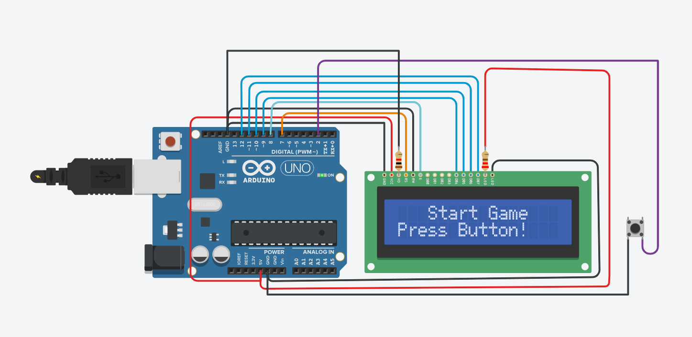

# MPMC Boy-Run Game 🏃‍♂️🎮

A retro-style endless runner game built using **Arduino Uno** and a **16x2 LCD Module**. The player controls a character that runs and must jump over obstacles (blocks) to survive. As the game progresses, the speed increases, making it more challenging!

## 📸 Project Preview

## ✨ Features
* **Custom Animation:** Uses custom character bytes (`run1`, `run2`, `jump`) to create a realistic running animation on the LCD.
* **Dynamic Difficulty:** The game speed (`speed` variable) increases automatically as your score gets higher.
* **Collision Detection:** The game instantly stops if the player hits an obstacle.
* **Score Tracking:** Displays your current score in real-time.

## 🛠️ Hardware Required
Based on the component list:
* **Arduino Uno R3**
* **16x2 LCD Display** (Liquid Crystal Display)
* **Push Button** (For Jump control)
* **Potentiometer** (250kΩ or 10kΩ for LCD contrast adjustment)
* **Resistor** (221Ω for LCD backlight protection)
* Jumper Wires & Breadboard

## 🔌 Circuit Connections (Pin Map)
Make sure to connect the components exactly as defined in the `game_in_c.ino` file:

| LCD Pin | Arduino Pin | Description |
| :--- | :--- | :--- |
| **RS** | Pin 9 | Register Select |
| **Enable (EN)** | Pin 8 | Enable Signal |
| **D4** | Pin 5 | Data Pin 4 |
| **D5** | Pin 4 | Data Pin 5 |
| **D6** | Pin 3 | Data Pin 6 |
| **D7** | Pin 2 | Data Pin 7 |
| **V0** | Potentiometer | Contrast Control |

**Control Button:**
* **Button Pin:** Pin 10 (Connect one leg to Pin 10, other to 5V/GND with resistor based on your wiring).

## 🚀 How to Play
1.  **Power Up:** Connect the Arduino to a power source.
2.  **Start:** The character will start running on the bottom row.
3.  **Jump:** Press the **Push Button** to make the character jump to the upper row to avoid the incoming block.
4.  **Game Over:** If you touch the block, the screen clears and shows your final score. Press the **Reset Button** on Arduino to play again.

## 📂 File Structure
* `game_in_c.ino`: Main source code containing game logic and custom characters.
* `component_list.csv`: List of hardware components used.
* `circuit_view.jpg`: Visual representation of the circuit.
* `schematic_view.jpg`: Technical schematic of the connections.

## 👨‍💻 Author
**Jain Nirav**

*Student, Electroni & Communication Department/GEC Gandhinagar, sector-28*

